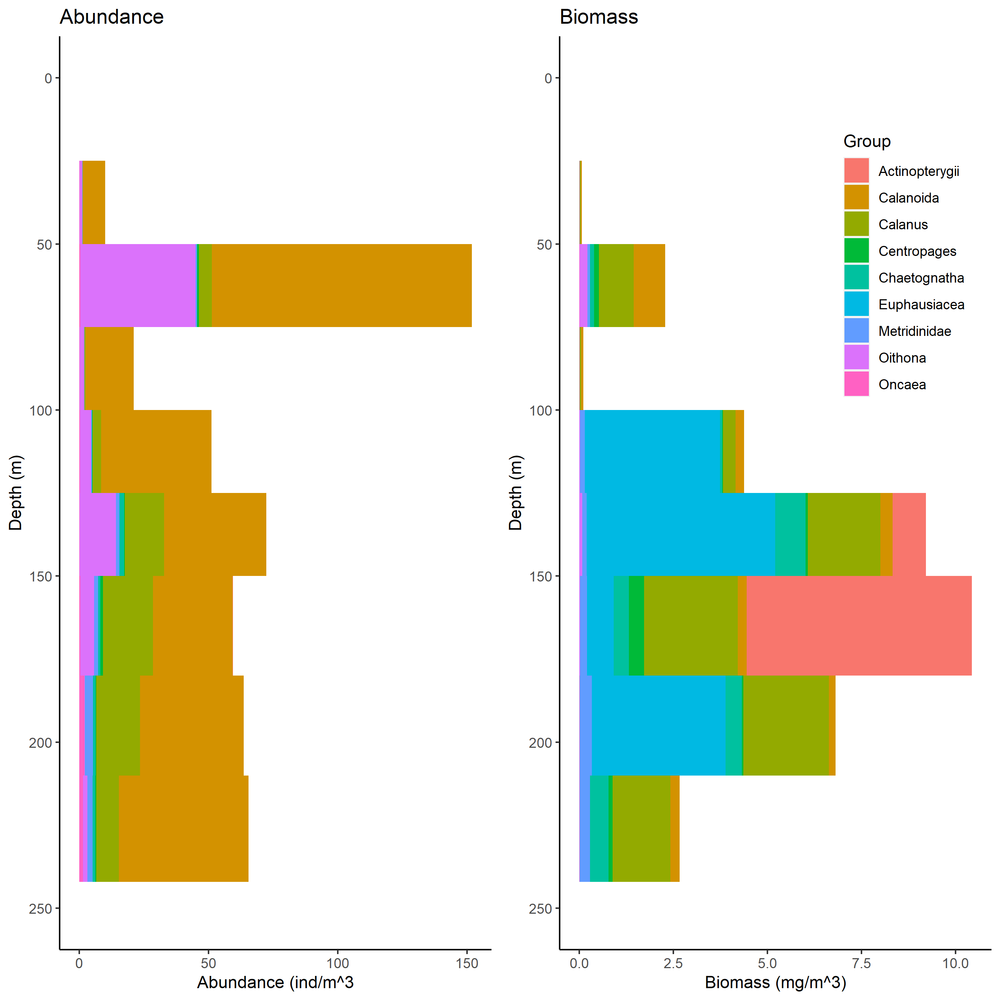
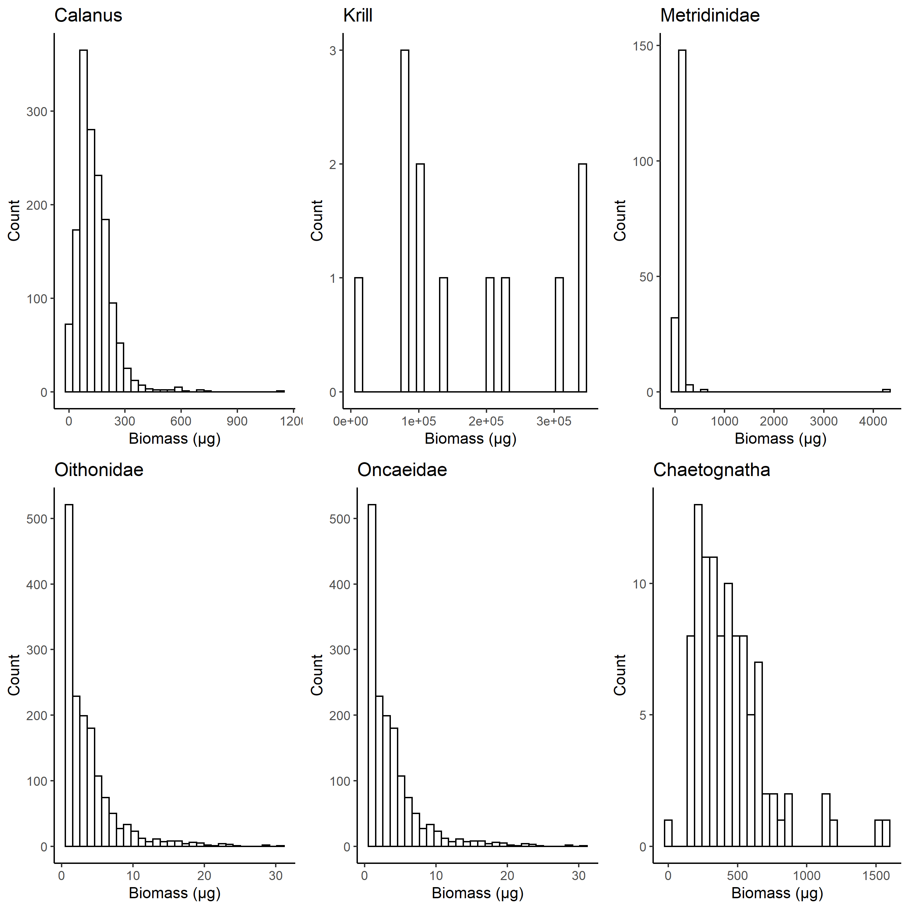

# G.O. Sars Multinet
## Code used for data analysis of Multinet Mammoth Data
### Hydrobios Multinet Mammoth
1m2 net opening, eight nets (#9 was in the surface and discarded) nets, 300µm mesh (?), oblique haul during darkness in the northern basin  at 2kn. 
Scanned on Epson V750 flatbed scanner at 2400dpi, processed using Zooprocess and uploaded to 
https://ecotaxa.obs-vlfr.fr/prj/6145

Exported data were used to estimate individual biomass according to Lehette & Hernandez-Leon (2006) and aggregated to depth layers.

Figure 1. Example images.

Figure 2. Vertical distribution of abundance and biomass of the major groups.

Figure 3. Weight distribution of the major groups.

