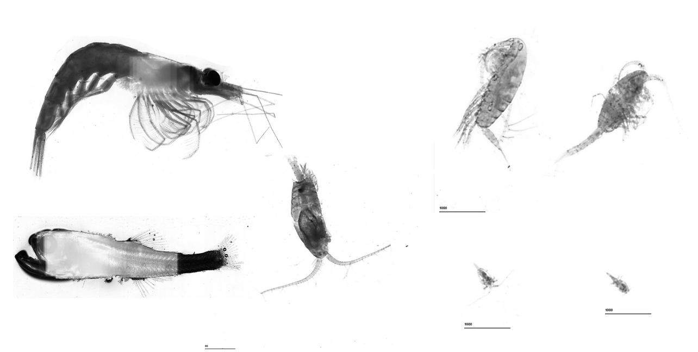

# G.O. Sars Multinet
## Code used for data analysis of Multinet Mammoth Data
### Hydrobios Multinet Maxi
Eight nets (#9 was in the surface and discarded) nets, 300µm mesh (?), oblique haul during darkness in the northern basin  at 2kn. 
Scanned on Epson V750 flatbed scanner at 1200dpi, processed using Zooprocess and uploaded to 
https://ecotaxa.obs-vlfr.fr/prj/6145

